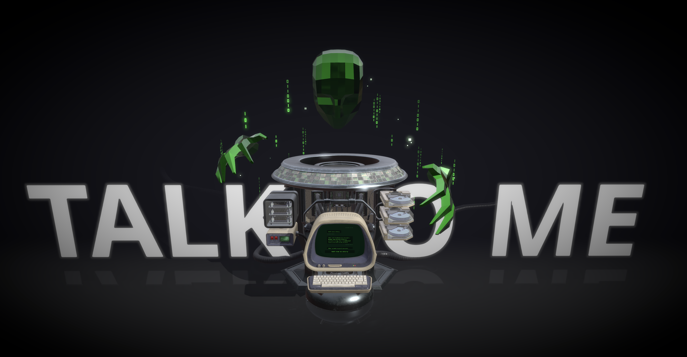
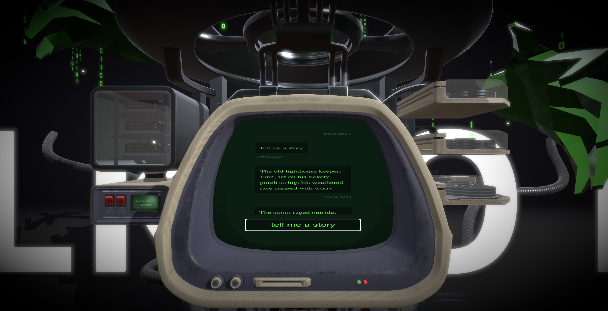

# 3D Gemini Chatbot

## Introduction
This repository was made for learning purposes and to demonstrate how to create an interactive 3D experience on the web.
The idea was to use a model of a robot which could be enhanced with a simple user interface. The purpose of the interface is to let the user send and receive messages from Gemini (Google's chatbot), just like in its own UI.
If the user writes bad words, the robot turns red, warning the user of a bad prompt.

## How to run

Run each of the following commands in a separate terminal.
Or build and run each of the Dockerfiles.
Or run the `docker compose up` in the root folder.

When everything is set up, access the frontend at `http://localhost:5173` and navigate through the 3D model.
Possibilities: rotation, zoom, and chatbot interaction.
Type a message and press enter to send it to the chatbot.

### Frontend
Run `npm install`
Run `npm run dev`

### Backend
Run `npm install`
Run `npm run dev` in the backend folder

## Technologies

### Frontend

    React (React Three Fiber)
    Typescript
    Three.js
    GraphQL (Apollo)
    Docker

### Backend
    Node.js
    Express
    GraphQL (Apollo)
    Docker

The 3D model was created by [dark_igorek](https://sketchfab.com/3d-models/cyber-djinn-7f56fd6b07cb44dba9b1d7f0e79bd8b8) - All rights reserved to him. Please check his amazing 3D work.